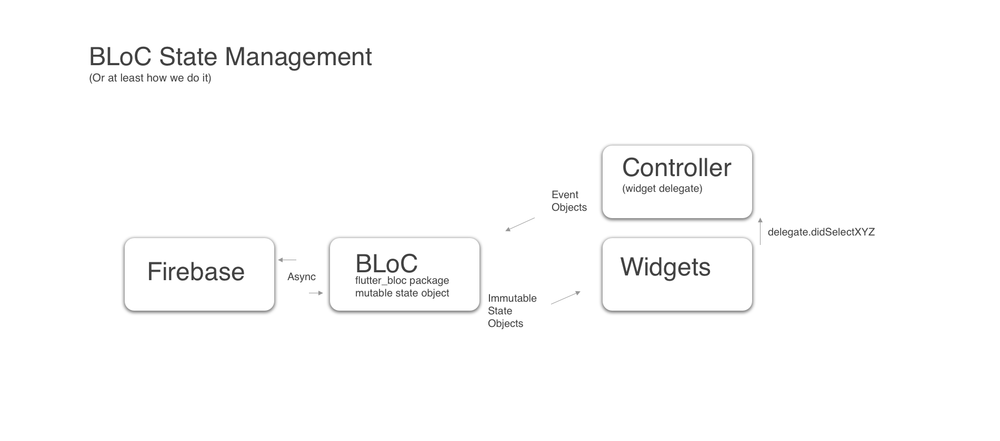

# 1AppStack

GENERAL DESCRIPTION

Manage Your Content
One App Stack helps admin users manage content. Built on top of Google’s Firebase, One App Stack gives you easy access to view, add, arrange, and remove data from Firestore, Realtime Database, and Storage.

Copy Code Snippets
Using the data paths (schemas) you create, One App Stack autogenerates a usable firebase abstraction to insert into your application and conrol the data locations you have defined

Create Data Paths
Easily combine paths and documents to give definition to your NoSQL database structure and File Storage.

Autogenerate database rules
One App Stack knows the paths to your data so it can suggest storage rules to protect your data.

Data Visualization
Visualize your backend with quickview visualization

Firebase NoSQL and File Storage
With Firebase at the core of the backend, your apps are ready to be deployed broadly on any platform and scale safely

One App Stack is in Alpha, Not yet deployed.
One App Stack is an open source project that exists to build useful Firebase abstractions for headless app creation. Please direct feedback and feature requests to the issue tracker github.com/halvorsen/oneappstack/issues

ARCHETECTURE AND APP DESIGN

BLoC pattern is used to manage state. State within the bloc object is mutable, there is an equivalent immutable version of state that is generated and sent to the widgets to generate the UI. Widgets are a direct function of the state sent from the BLoC object [widgets = f(state)]. Therefore the widgets are not changing app state. We make two exceptions, 1. If it's a widget only state, such as an animation, this is handled within the stateful widget, 2. simpler pages might use setState({}) within the stateful widget if there isn't much logic involved in the page. flutter_bloc employs provider widgets to listen to unique state that is streamed from the BLoC object and an add message to send events to the BLoC. The key to the BLoC pattern is to only send event objects into the BLoC and only send immutable state objects from the BLoC to the widgets.

We prefer stateless widgets when possible. We prefer to delegate actions from the user to one widget delegate for the page, we call this the controller. You'll notice that all Event objects are only added to the 'flutter_bloc package' event stream from the controller. This makes for a good division of responsibility.

Popover controller is a slick way to easily add popups to the 'overlay' layer through a notification pattern. Again the events from the popups are handled by the page's controller, widget delegate.

